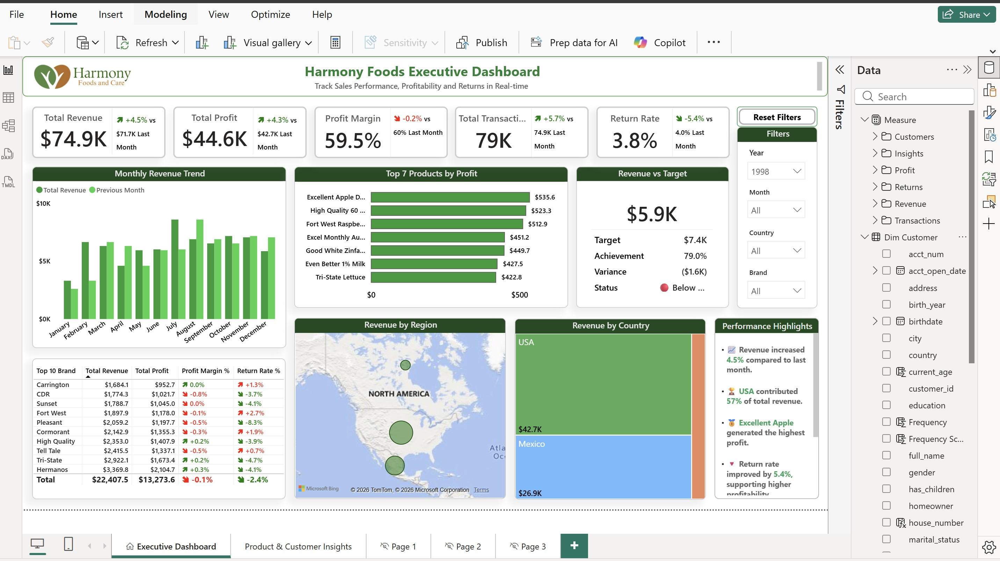
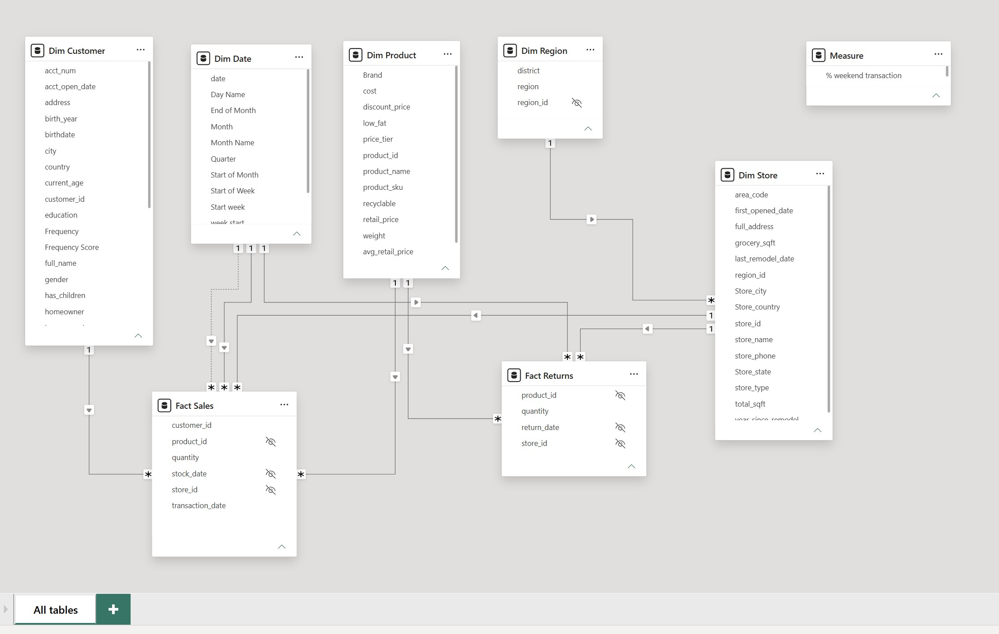
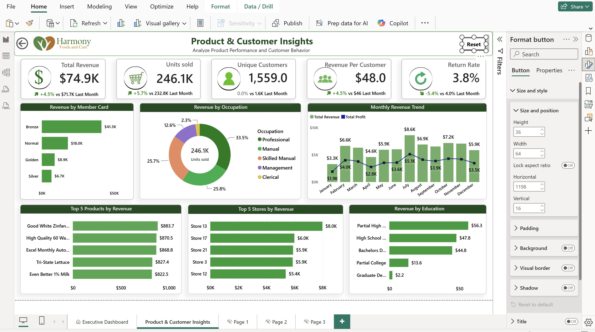

# Noodle Soup Maven – Sales & Customer Analytics Dashboard

An interactive Power BI sales and customer analytics dashboard analysing revenue, profitability, products, stores, customer behaviour, and returns using a star-schema data model, DAX measures, and interactive business intelligence visualizations.

## Project Overview

This Power BI project analyses sales performance, profitability, customer behavior, product performance, and returns for a food and beverage business. The dashboard transforms transactional sales data into interactive business insights, helping decision-makers monitor key KPIs, identify top-performing products and stores, understand customer segments, and track revenue and profit trends.

The project uses a star-schema data model with dedicated dimension tables for customers, products, dates, regions, and stores, connected to sales and returns fact tables. DAX measures are used to calculate key business metrics such as Revenue, Profit, Profit Margin, Units Sold, Unique Customers, Revenue per Customer, Return Rate, Month-over-Month performance, and Revenue vs Target.

The dashboard consists of an **Executive Dashboard** for high-level performance monitoring and a **Product & Customer Insights** page for deeper analysis of customer demographics, product performance, store performance, and sales trends. Interactive filters, KPI cards, drill-through functionality, and dynamic visualizations enable users to explore performance from different business perspectives.

## Data Model

Star-schema design:
- **Fact tables:** Fact Sales, Fact Returns
- **Dimension tables:** Dim Customer, Dim Product, Dim Date, Dim Region, Dim Store

## Dashboard Pages

### 1. Executive Dashboard
High-level KPIs — Total Revenue, Total Profit, Profit Margin, Total Transactions, Return Rate — with monthly revenue trends, top products by profit, revenue vs target, and geographic revenue breakdown.

### 2. Product & Customer Insights

Deeper analysis of revenue by member card tier, occupation, education, top products/stores by revenue, and monthly trends.

## Key Features
- Executive-level sales and profitability overview
- Revenue, profit, margin, transaction, and return KPIs
- Month-over-month performance tracking
- Revenue vs Target and achievement analysis
- Top-performing products and stores
- Revenue analysis by country and region
- Customer analysis by occupation, education, and membership card
- Return rate monitoring
- Interactive slicers and filter reset functionality
- Star-schema data model with Fact and Dimension tables
- DAX-based business metrics and time intelligence

## Tools & Technologies
Power BI · DAX · Power Query · Data Modelling · Data Visualization · Business Intelligence

## Business Objective
The primary objective of this project is to provide a centralized analytical view of business performance and enable stakeholders to quickly identify revenue trends, profitability drivers, high-performing products and stores, customer behaviour, and return patterns to support data-driven business decisions.

## Repository Contents
- `powerbi/` — the Power BI `.pbix` file
- `images/` — dashboard and data model screenshots

## How to View
1. Download the `.pbix` file from the `powerbi/` folder.
2. Open it in [Power BI Desktop](https://www.microsoft.com/en-us/power-platform/products/power-bi/downloads) (free).